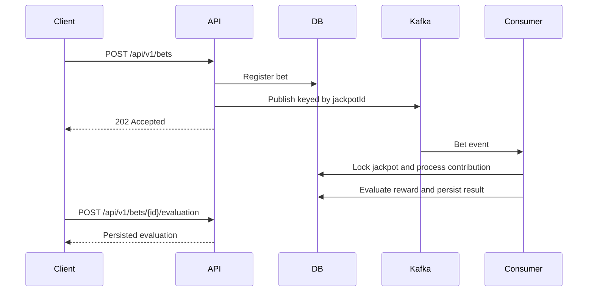

# Jackpot Service

An implementation of an asynchronous jackpot service. It accepts bets,
publishes them through Kafka, contributes each valid bet to a jackpot, and persists one reward
evaluation per bet.

The implementation prioritizes correctness under retries and concurrent requests, explicit domain
rules, and a reviewable test suite over production infrastructure breadth.

You can try a simulation demo published at: <https://jackpot.demo.app01.es/demo>

## At A Glance

| Area | Implementation |
| --- | --- |
| Runtime | Java 21, Spring Boot 3 |
| API | OpenAPI-first REST API with generated interfaces and Swagger UI |
| Messaging | Kafka producer/consumer, bounded retries, dead-letter topic, stale-publication recovery |
| Persistence | Spring Data JPA, Flyway, in-memory H2 |
| Correctness | Database constraints, pessimistic locking, transactional processing, persisted idempotency |
| Testing | Unit, contract, persistence, concurrency, workflow, and embedded-Kafka integration tests |

## Reviewer Quick Start

Prerequisites:

- Java 21
- Docker with Compose support only when running the local Kafka workflow

The Maven Wrapper is included, so Maven does not need to be installed separately.

## Run Modes

### Log-Only Mode

This is the simplest mode. It runs without Kafka and is useful for API exploration:

```bash
./mvnw spring-boot:run -Dspring-boot.run.profiles=log
```

On Windows PowerShell or Command Prompt, quote the `-D` argument:

```powershell
.\mvnw.cmd spring-boot:run "-Dspring-boot.run.profiles=log"
```

Accepted bets return `PUBLISHED`; they are intentionally not contributed or evaluated.

### Complete Kafka Workflow

Kafka is the default mode. The application provisions `jackpot-bets` and `jackpot-bets.DLT` with
three matching partitions and replication factor `1`, suitable for the one-broker local setup.

```bash
docker compose up -d
./mvnw spring-boot:run
```

Override `jackpot.messaging.partitions` and `jackpot.messaging.replication-factor` for another
cluster.

### Inspect The Development Database

This mode enables the H2 console and keeps Kafka messaging active. For local development, Kafka
publication waits are capped at `1000` ms so a missing broker fails quickly.

```bash
./mvnw spring-boot:run -Dspring-boot.run.profiles=dev
```

On Windows PowerShell or Command Prompt:

```powershell
.\mvnw.cmd spring-boot:run "-Dspring-boot.run.profiles=dev"
```

Open <http://localhost:8080/h2-console> and connect with:

```text
JDBC URL: jdbc:h2:mem:jackpot
User Name: sa
Password: leave empty
```

The H2 database is in memory and resets when the application stops.

When the app is running, open Swagger UI at <http://localhost:8080/swagger-ui.html>.

Run the complete verification suite. Docker is not required because the Kafka workflow test uses an
embedded broker.

```bash
./mvnw clean verify
```

Useful review entry points:

- [`src/main/openapi/jackpot-api.yaml`](src/main/openapi/jackpot-api.yaml) defines the public
  contract.
- [`Jackpot.java`](src/main/java/com/example/jackpot/jackpot/domain/Jackpot.java) holds the central
  domain invariants.
- [`PublishBetService.java`](src/main/java/com/example/jackpot/bet/application/PublishBetService.java)
  handles idempotent bet registration and publication.
- [`JackpotBetProcessingService.java`](src/main/java/com/example/jackpot/jackpot/application/JackpotBetProcessingService.java)
  processes a contribution and reward evaluation in one transaction.
- [`KafkaJackpotWorkflowIntegrationTest.java`](src/test/java/com/example/jackpot/workflow/KafkaJackpotWorkflowIntegrationTest.java)
  verifies the real producer-consumer workflow.
- [`V1__create_jackpot_schema.sql`](src/main/resources/db/migration/V1__create_jackpot_schema.sql)
  shows the database-level invariants.

## Problem And Behavior

The service exposes two operations:

- `POST /api/v1/bets` validates, stores, and publishes a bet asynchronously.
- `POST /api/v1/bets/{betId}/evaluation` returns the persisted evaluation, or evaluates a
  contributed bet if necessary.



`202 Accepted` confirms publication acceptance. It does not guarantee that Kafka consumption and
reward evaluation have finished. An evaluation request made too early returns `409 Conflict`.

## Key Engineering Decisions

### Business-Level Idempotency

This service does not claim Kafka exactly-once delivery. Instead, it makes repeated delivery safe at
the business layer:

- A repeated `betId` with the same payload returns the existing result without processing twice.
- Reusing a `betId` with different data returns `409 Conflict`.
- Contributions, evaluations, and rewards are unique by `betId`.
- A persisted evaluation is returned on every later request, so a reward is never rerolled.
- Database uniqueness constraints remain the final authority during concurrent duplicate requests.

### Concurrency And Transaction Boundaries

- Bet, contribution, and jackpot rows use pessimistic write locks where concurrent updates matter.
- Contribution and reward evaluation execute in one transaction.
- A winning evaluation stores the awarded pool and resets the jackpot atomically.
- Kafka events use `jackpotId` as their key to preserve per-jackpot ordering within a partition.

Partition ordering helps, but database locking still protects correctness during API calls,
redelivery, and multiple consumer instances.

### Money And Probability Precision

- Incoming bet amounts allow two decimal places and are never silently rounded.
- Jackpot pools, contributions, and rewards use eight decimal places.
- Probabilities and generated draws use four decimal places.
- Domain objects normalize and validate values before persistence.

This allows a `0.01` bet at a `1%` rate to contribute exactly `0.00010000`.

### Extensible Jackpot Policies

Contribution and reward policies implement small strategy interfaces and self-register by stable
keys. Each jackpot persists its selected strategy and parameter map, allowing different jackpot
behavior without branching in the application services.

Two examples are seeded at startup:

- **Fixed jackpot:** fixed contribution percentage and reward chance.
- **Variable jackpot:** contribution percentage decreases and reward chance increases as its pool
  grows.

### Contract And Schema Ownership

- The OpenAPI document is the API source of truth; Maven generates controller interfaces and DTOs.
- Contract tests validate the committed specification, generated sources, and Swagger UI.
- Flyway owns the database schema; Hibernate validates rather than creates it.
- API failures use RFC Problem Details.
- Application time comes from one injectable `Clock` for deterministic tests.

### Failure Recovery

- A failed Kafka publication records its attempt and sanitized error.
- A scheduled job atomically claims stale pending publications and retries them.
- Consumer failures receive three bounded retries at one-second intervals.
- Non-retryable business failures and exhausted retryable failures go to `jackpot-bets.DLT`.
- Identifiable failed bets are marked `PROCESSING_FAILED`.

## API Example

The following request targets the seeded fixed-policy jackpot:

```bash
curl --request POST http://localhost:8080/api/v1/bets \
  --header 'Content-Type: application/json' \
  --data '{
    "betId": "aaaaaaaa-aaaa-aaaa-aaaa-aaaaaaaaaaaa",
    "userId": "bbbbbbbb-bbbb-bbbb-bbbb-bbbbbbbbbbbb",
    "jackpotId": "11111111-1111-1111-1111-111111111111",
    "betAmount": 10.00
  }'
```

After Kafka processing completes, retrieve the persisted evaluation:

```bash
curl --request POST \
  http://localhost:8080/api/v1/bets/aaaaaaaa-aaaa-aaaa-aaaa-aaaaaaaaaaaa/evaluation
```

Validation rejects non-positive amounts, amounts with more than two decimal places, and amounts
above `99999999.99`.

## Project Structure

```text
src/main/
├── openapi/                 # Public API source of truth
├── resources/
│   └── db/migration/        # Flyway-managed schema
└── java/com/example/jackpot/
    ├── bet/
    │   ├── api/             # Bet HTTP adapter
    │   ├── application/     # Publication and recovery use cases
    │   ├── messaging/       # Kafka and log-mode adapters
    │   └── persistence/     # Bet JPA adapter
    ├── jackpot/
    │   ├── api/             # Reward HTTP adapter
    │   ├── application/     # Contribution and reward use cases
    │   ├── domain/          # Domain model, policies, and configuration
    │   └── persistence/     # Jackpot JPA adapter
    ├── configuration/       # Application wiring and seed configuration
    └── shared/              # Money rules and API error handling
```

## Testing Strategy

```bash
./mvnw clean verify
```

The suite covers:

- Domain policy behavior and monetary invariants
- OpenAPI contract validity and generated-interface compilation
- Flyway schema constraints and JPA mappings
- Concurrent duplicate publication, contribution, and reward evaluation
- Kafka publisher, consumer, retry, DLT, and application-context configuration
- End-to-end synchronous and embedded-Kafka workflows

Run formatting separately when changing Java sources:

```bash
./mvnw spotless:apply
```

## Deliberate Scope And Production Follow-Ups

The assignment keeps infrastructure local and focuses on application correctness. For production,
the next changes would be:

- Replace H2 with a durable database and test against the selected engine.
- Replace the database-to-Kafka publication gap with a transactional outbox and relay.
- Add authentication, authorization, rate limiting, metrics, tracing, and alerting.
- Add an operational DLT replay process and retention policy.
- Load-test per-jackpot lock contention and adjust the partitioning or processing model as required.
- Version and migrate persisted strategy parameters as policy definitions evolve.

These are explicit tradeoffs rather than hidden guarantees: the current design provides
business-level idempotency and recovery, but it does not provide distributed exactly-once
transactions between the database and Kafka.
